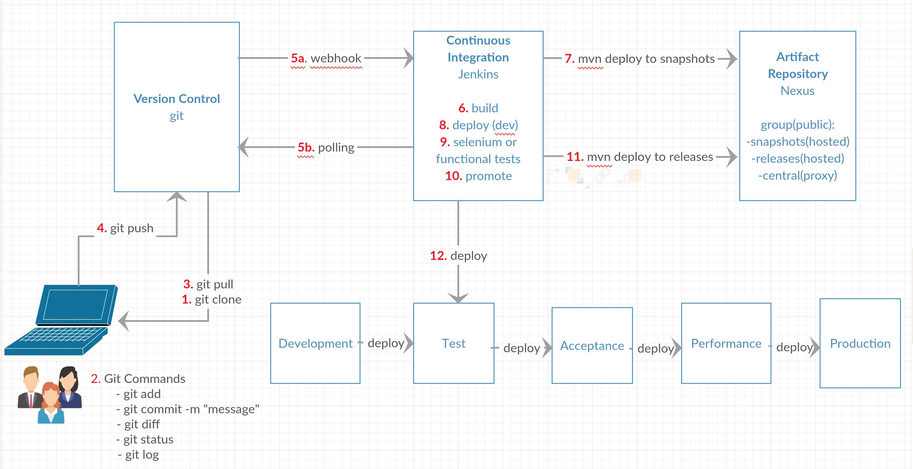

## CI/CD Workflow Diagram

## Jenkins

- After installing Jenkins, using 'Manage Plugins' in 'Manage Jenkins', install following plugins
  * Environment Injector
  * Build Pipeline
  * Deploy Pipeline
  * Cobertura 
- Create a folder 'petclinic-demo' inside your local jenkins
- Copy the content from 'jenkins' to petclinic-demo directory in jenkins 'jobs' folder
- Click 'Manage Jenkins' -> 'Reload Configuration from disk'
